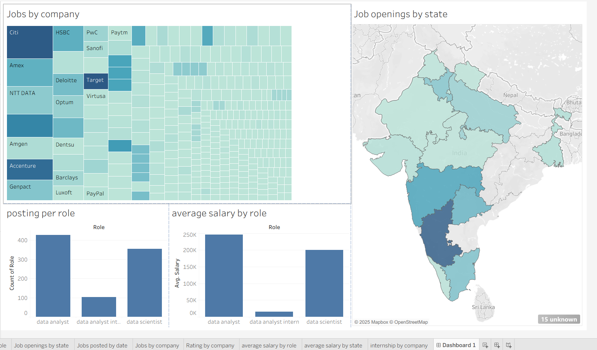

# **Project Title**

Data Science Job Market Analysis in India (Indeed Web Scraping + SQL + Tableau)  

# **Overview**

When searching for internships, I realized how difficult it was to find reliable job postings in India’s data science domain. Many listings are fake, scattered, or lack salary transparency. While global data exists, I wanted to analyze the Indian job market for Data Analysts, Data Scientists, and related internships.

This project uses:  
Web Scraping (Indeed job listings)  
SQL (MS SQL Server) for cleaning & preprocessing  
Tableau for visualization  
Final dataset: ~2000 scraped → cleaned to 800 job postings  

# **Visualisation link**
[Tableau public link](https://public.tableau.com/views/DataScienceJobMarketAnalysisinIndia/Dashboard1?:language=en-US&:sid=&:redirect=auth&:display_count=n&:origin=viz_share_link)

# **Stakeholder Questions Addressed**  

Job Market Overview  
Job postings per role (Analyst vs Scientist vs Intern)  
Opportunities by city/state  
Posting trends over time  
Company Insights  
Which companies hire the most data professionals  
Company size vs rating distribution  
Salary Trends  
Average salary per role  
Salary variation by state/city  
Intern vs Full-time salary insights  
Company Reputation (Ratings & Reviews)  
Highest-rated companies  
Review counts vs company size  
Ratings vs salaries  
Geographic Insights  
Highest-paying states/cities  
Internship concentration by geography  

# **Visualizations (Tableau)**

Bar Chart → Job postings per role  
Map → Job openings by state  
Line Chart → Jobs posted over time  
Heatmap → Jobs by company  
Heatmap → Company ratings  
Bar Chart → Average salary by role  
Map → Average salary by state  
Heatmap → Internships offered by company  

# **Tools Used**

Online API – Web scraping  
MS SQL Server – Cleaning & preprocessing (~2000 → 800 rows)  
Tableau – Data visualization & dashboarding  

# **Key Insights**

Data Analyst roles dominate postings, but Data Scientist roles show higher average salaries.  
Bangalore, Hyderabad, and Pune lead in job opportunities.  
Salaries vary significantly by state, with metro cities offering the highest packages.  
Company ratings don’t always correlate with salaries — some high-paying firms have average ratings.  
Internships are concentrated in startups and mid-sized firms, often with unclear salary data.  
